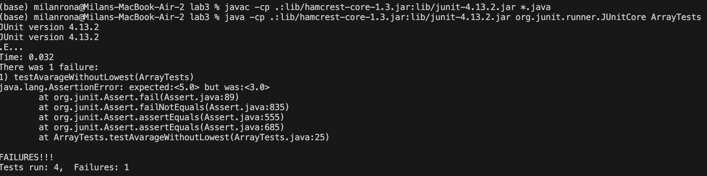

## Lab Report 3

---

# Part 1

- I am going to choose avaragewithout lowest methods bug. This method takes a list of integers and returns the mean without the lowest number.

- This test induces a failer

`@Test
  public void testAvarageWithoutLowest() {
    double[] input1 = {4, 4, 6};
    assertEquals(5, ArrayExamples.averageWithoutLowest(input1), 0.1);
  }`

- This input doesn't induce a failer
`@Test
  public void testAvarageWithoutLowest2() {
    double[] input1 = {1, 2, 4, 6, 8};
    assertEquals(5, ArrayExamples.averageWithoutLowest(input1), 0.1);
  }`

- Screenshot of running the junit test

(The one failure is from the test i wrote, without the lowest score it should have been 5.0 but since the code was wrong it produced 3.0)

-Fixing the code 

Before: 
` static double averageWithoutLowest(double[] arr) {
    if(arr.length < 2) { return 0.0; }
    double lowest = arr[0];
    for(double num: arr) {
      if(num < lowest) { lowest = num; }
    }
    double sum = 0;
    for(double num: arr) {
      if(num != lowest) { sum += num; }
    }
    return sum / (arr.length - 1);
  }`

After: 
`static double averageWithoutLowest(double[] arr) {
    if(arr.length < 2) { return 0.0; }
    double lowest = arr[0];
    for(double num: arr) {
      if(num < lowest) { lowest = num; }
    }
    double sum = 0;
    for(double num: arr) {
      sum += num;
    }
    return (sum - lowest) / (arr.length - 1);
  }`

  - This fixes the problem since now the method doesn't just loop through the list and take out all the numbers that are equal to the lowest, but rather it subtractes the lowest number from the sum. This works for if the lowest number is negative. This way the lowest only gets taken out once.

---

# Part 2

- I will be choosing grep.

- Grep option `-v`
example1:
input, currently in the `technical/biomed`directory: `grep -vi a 1471-213X-1-3.txt `

Output: ` Results
          previously reported [ 22].
          present in most sections.
          to posterior TM differences described for B6 were evident
          Electron microscopy
          of this period (see Methods), including four time points
        Discussion
          morphogenesis
          In this study, we describe the morphogenesis of the
          19].
          morphogenesis.
          development
          this.
        Conclusions
        dysgenesis. 
          Light microscopy
          sections per eye. Collected regions included the lens
          Electron microscopy`
          
explanation: Shows all lines that do not contain the letter `a` or `A`, I added the `-i` option in order to narrow the search down a little bit. The command I inputted looks for lines in the `1471-213X-1-3.txt` file. The `a` shows that that is the word i am not looking for 

example 2:

input, currently in the `government/Media` directory: `grep -v e Major_Changes.txt`  

Output: 
`Corporation.
two programs of its own.
Brooklyn.
Bronx Program's Lawsuit
with LSNY.
corporation.`

explanation: Shows all the lines in `Major_Changes.txt` file that do not include the letter e. I checked the file with `wc`, and it outputed that it has 125 lines, but in this grep it narrowed it down to 6, due to the fact that it only outputed the lines that do not have the letter `e` in them. 

- Grep option `-n`

Example 1:
input, currently in the `government/Media` directory: grep -nr due 

Output: `./Helping_Out.txt:86:decreased by half during the 1990's due to declining interest
./Helping_Out.txt:103:low-income family by obtaining funds rightfully due them. If you
./Unusual_Woodburn.txt:67:for lengthy periods due to communication barriers.
./Legal_Aid_in_Clay_County.txt:16:due to budgetary constraints and staffing limitations.
./Abuse_penalties.txt:45:"It places an undue burden on the plaintiff, in terms of cost,
./Barnes_pro_bono.txt:30:his surprise loss to Sonny Perdue on Nov. 5. Asked about his legacy
./Too_Crucial_to_Take_Cut.txt:28:his teeth out but, due to a budget crisis, the department decided
./Pro_Bono_Services.txt:73:One reason, she said, is a due to a limited budget.
./Survey.txt:65:education. These needs go unfilled due to the limited availability
./AP_LawSchoolDebts.txt:21:government is facing losses of over half its work force due to
./Eviction_law.txt:34:is being punished. That's kind of a basic due process notion that
./Commercial_Appeal.txt:25:$200,000 in 2003 and beyond, largely due to a drop in the number of
./Texas_Supreme_Court.txt:22:Texas dues statement that requires attorneys to "opt-out" of making
./Service_Agency.txt:42:right to due process and a fair hearing, the first successful
./Domestic_violence_aid.txt:35:boyfriend for eight years, said such a program is long overdue and
./fight_domestic_abuse.txt:27:lost about $120,000 in grant money due to a decrease in the poverty
./Lawyer_Web_Survey.txt:33:options due to low salaries and enormous law school loan
./Farm_workers.txt:63:The exposure comes from chemical residue on plants in farm
./Politician_Practices.txt:17:Perdue. I had the misfortune of watching one of the Barnes-Perdue
./Politician_Practices.txt:45:homeowners fleeced by lenders and the like. But due to the federal
./A_Perk_of_Age.txt:37:reach all 50 by the end of March. You have to pay the group's dues
./NJ_Legal_Services.txt:100:satisfy due process.`

Explanation: I needed to add the `-r` option in order to be able to recursivly do this option, In this case it is looking for matches of `due` in all the files in the current directrory. The option `-n`, makes it so that when the matches are shown it includes the line numbers in the output, therefore you not only know which text files has a line with due, but also which line of the file it is at.

Example 2: 
Input, currently in the `technical/biomed`directory: `grep -n brain 1471-213X-1-9.txt`

Output: 
`46:        mammalian brain [ 26], the retina [ 27, 28, 29], and the
55:        small set of lateral neurons in the brain [ 32] while
193:          retina, brain, heart, liver, lung, kidney, ovary,
329:          from the mid-brain, which contains the hypothalamus
332:          samples excised from the midbrain of C3H/He and C57/Bl6
336:          brain expression of 
347:          intensity of the hybridization in several brain regions,
351:          in these brain regions (including the SCN), we have not
352:          detected rhythmic expression in the brain comparable to
454:        mNoc mRNA in brain and pineal tissue.
456:        expressed in multiple brain regions including the
562:        oscillator in the brain [ 50]. An understanding of the
703:          halothane anesthesia. The brain was removed, frozen on`

Explanation: In this case we are trying to find brain in this `1471-213X-1-9.txt` file. It outputs the lines which contain brain, and specify's which numbered line it is from 

- Grep option `-b`

Example 1:

Input, currently in the `technical/biomed`directory: `grep -c brain 1471-213X-1-9.txt`

output: 
`13`

explanation: Option `-c` outputs the number of lines that have the word `brain` in the file `471-213X-1-9.txt`. This works somewhat similarly to `wc`, where it is counting lines, you could get similar output with `grep brain 1471-213X-1-9.txt > myfile.txt` and `wc myfile.txt`. So it seems to be a shortcut.

Example 2:

input, currently in the `government/Alcohol_Problems` directory: `grep -cr alc`

Output: 
`./Session2-PDF.txt:97
./Session3-PDF.txt:168
./DraftRecom-PDF.txt:53
./Session4-PDF.txt:164`

explanation: This is recursivly looking through the directory and counts for each file, how many lines contain the word `alc`. I added the `-r` option so i can do this for all files in the current directory.

- Grep option `-C`

Example 1: 

input, currently in the `government/Alcohol_Problems` directory: `grep -C 2 surgery DraftRecom-PDF.txt`

Output: 
`Research on alcohol problems is as important as research on sepsis
and CPR. At the NIH web site, he found no information on
alcohol-related research in the surgery section. It was all in the
alcohol section, which surgeons do not explore. If we want surgeons
to become interested, it should be repeated in the surgery
section.
Longabaugh remarked that NIH is increasingly trying to`

Explanation: Option `-C [num]` shows the lines before and after, the line with the matching input. In this case it is showing 2 lines that are trailing and after the lines that include `surgery`. This options can give you context for the given word you are looking for. 
input, currently in the `government/Env_Prot_Agen` directory: grep -rC 2 weather
Example 2:

input, currently in the `government/Env_Prot_Agen` directory: `grep -rC 2 weather`

`./final.txt-mortality and reduced growth of tree seedlings, and increased plant
./final.txt-susceptibility to diseas, pests, and enviromental stresses (e.g.,
./final.txt:harsh weather). since nox emissions result in formation of 
.final.txt-and thus reduce the deleterious effects of ozone on human health`
`--`
`./tech_adden.txt-day-to-day basis in an individual area. A number of multi-city and
./tech_adden.txt-other types of studies strongly suggest that these
./tech_adden.txt:effects-relationships cannot be explained by weather, statistical
./tech_adden.txt-approaches, or other pollutants. The risk estimates from the vast
./tech_adden.txt-majority of the short-term studies include the effects of only one`

Explanation: We are recursivly looking through the current directory and looking for matches and outputing the preciding 2 lines and the 2 lines after. This is useful to get more understanding in which context the the word we are looking for is being used. 

