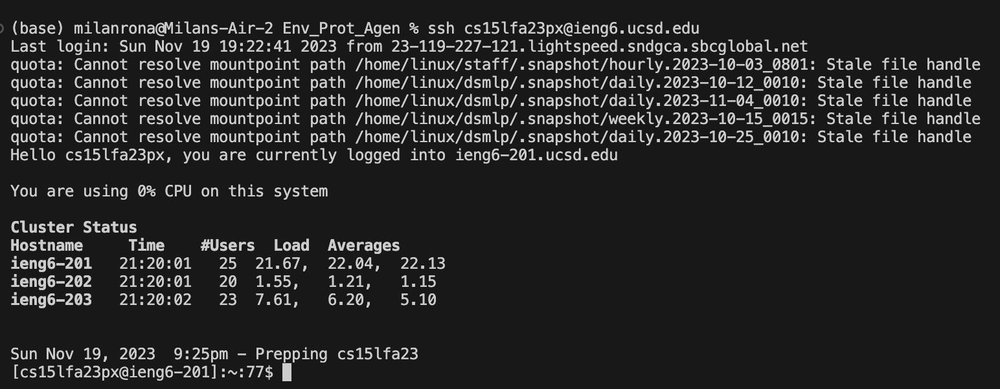
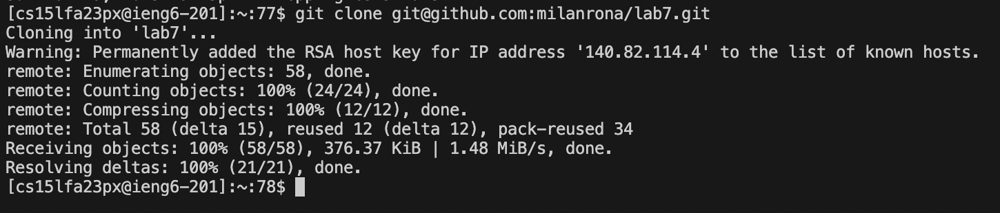
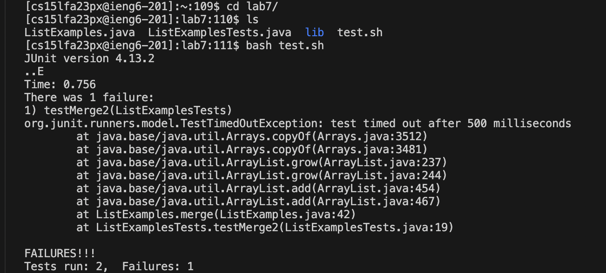
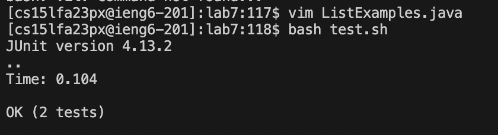
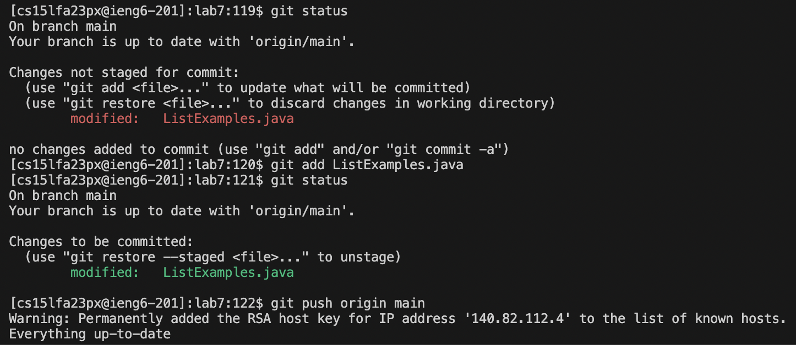
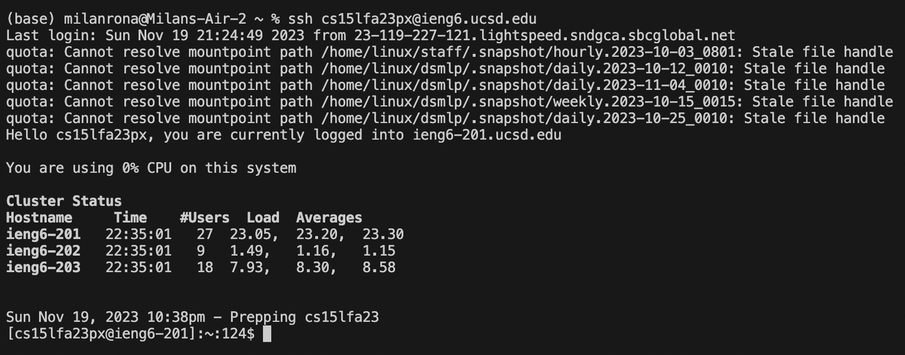
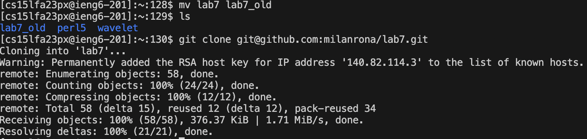
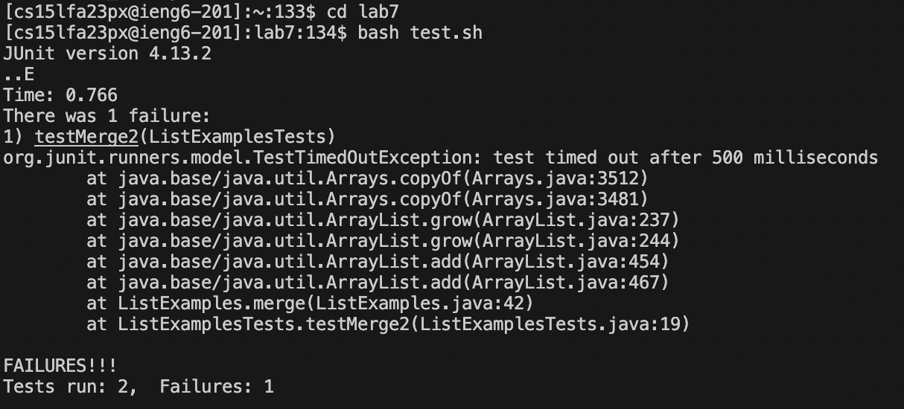
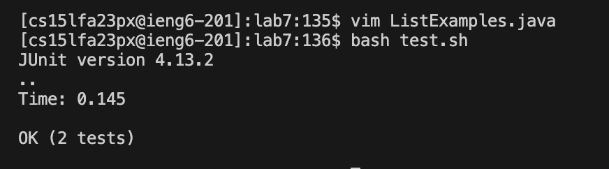
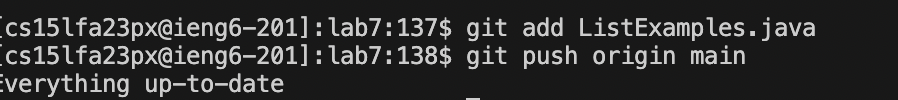

## Lab Report 4

 # BaseLine

Step 4:
  typed: `ssh cs15lfa23px@ieng6.ucsd.edu <Enter>`

  
  

Step 5:
  typed: `git clone git@github.com:milanrona/lab7.git <Enter>`

  
  

Step 6:
  typed: `cd lab7` `<Enter>` (autofills to lab7)
         `ls` (to check what files i have to run)
         `bash test.sh <Enter>` (run the tests)

         
  

  

Step 7-8:

  typed: `<k> <k> <k> <k> ...` (44 times to get to the designated line)
        `<l> <l> <l> <l> <l> <x>` (deleting the number 1)
        `<i> <2>` (in order to insert the 2)
        `<ESC> :wq` (save and quit Vim)
        `<up> <up> <Enter>` (run the `bash test`)

        
  

Step 9:

  typed: `git status <Enter>` (check if everything is correct and saved)
        `git add ListExamples.java <Enter>`
        `git status <Enter>` (check status again)
        `git push origin main` (push to github)

        
  

--
# SpeedRun

Step 4: 

    typed: `<CTRL> <r> ssh <Enter>` (log into ssh)

    
 

Step 5:

    typed: `git clone <Command> v <Enter>` (clone the respo)

    
 
 (had to change the name of the baseline lab7)

Step 6: 

   typed: `cd lab7 <Enter>` (change directory to lab7)
         `<Command> r ba <Enter>` (run the test)

         
 

step 7:

    typed:`vim li <tab> .java` (to be able to edit the file)
    `:44` (get to line 44)
    `<e> <x> <i> 2` (skip to the end of the first word, than delete and insert 2)
    `<Esc> :wq` (to go back to normal mode and save and quit)

    
Step 8: 

    typed: `<up> <up> <Enter>` (run bash test.sh again)

 

 step 9:

   typed: `<Control> <r> git a <Enter>` (to git add)
         `<Control> <r> git p <Enter>` (push to main)
         

   
    

  

        
  
