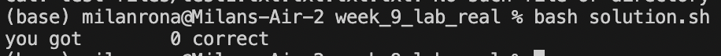
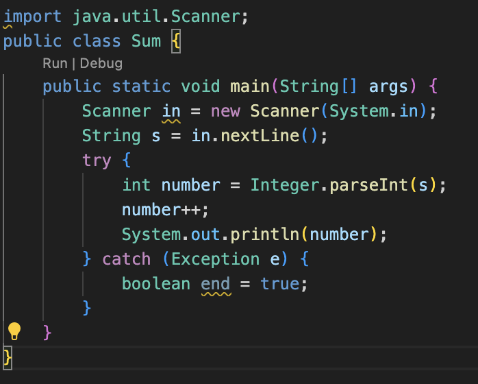
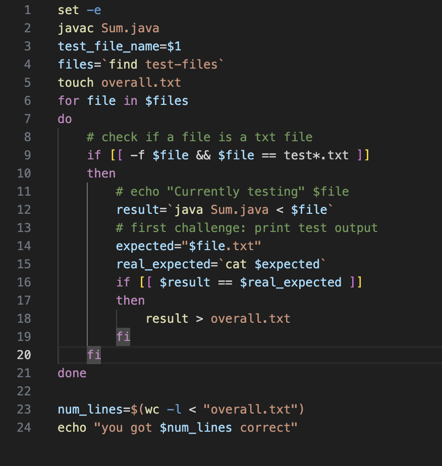

# Lab Report 5

## Part 1

Question:

I get this output when i run my solution.ssh. It is supposed to be correct, but with my input it should say that 1 is correct.

Response:
c 
"question why only at 1 input it works and at others it doesn't"

Student:
Changes > to >>

- End

- `week9`
      - `week9/Sum.java`
      - `week9/solution.ssh`
      -  `test-files`
          - `test1.txt`
          - `test1 a.txt`

Sum.java: 

## Part 2

- For me presonally, the bash scipt was the most new and interesting. Never would have i thought that you can make repetivtive work that musch quicker. I found week 6 and 9's lab the most interesting since we had to create a bash script. While it is very useful it is challenging aswell for example where to put `space` for `if` statements. This topic seems very useful for the future.

