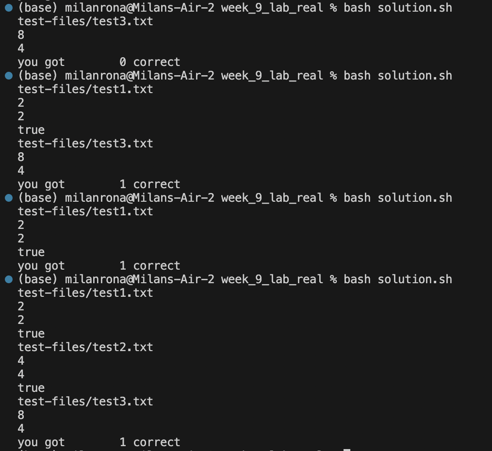
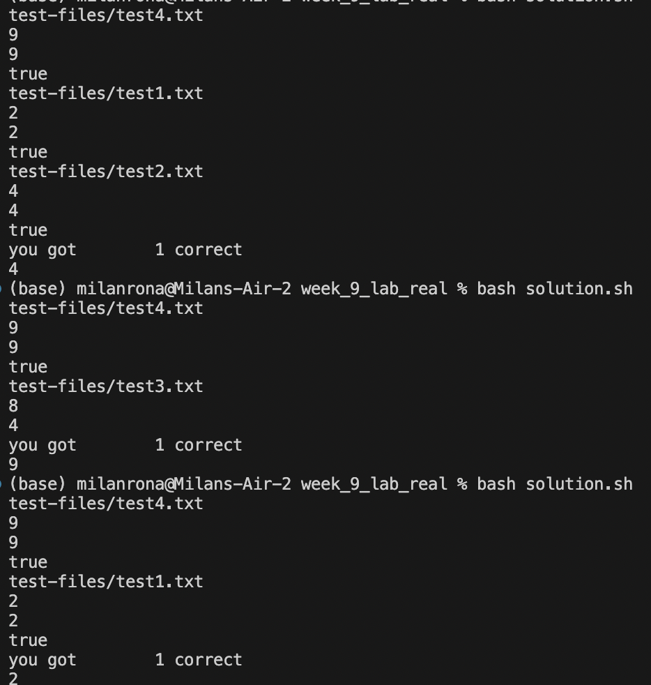
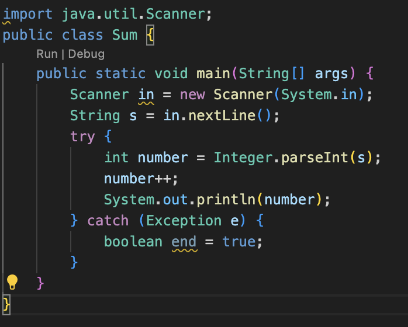
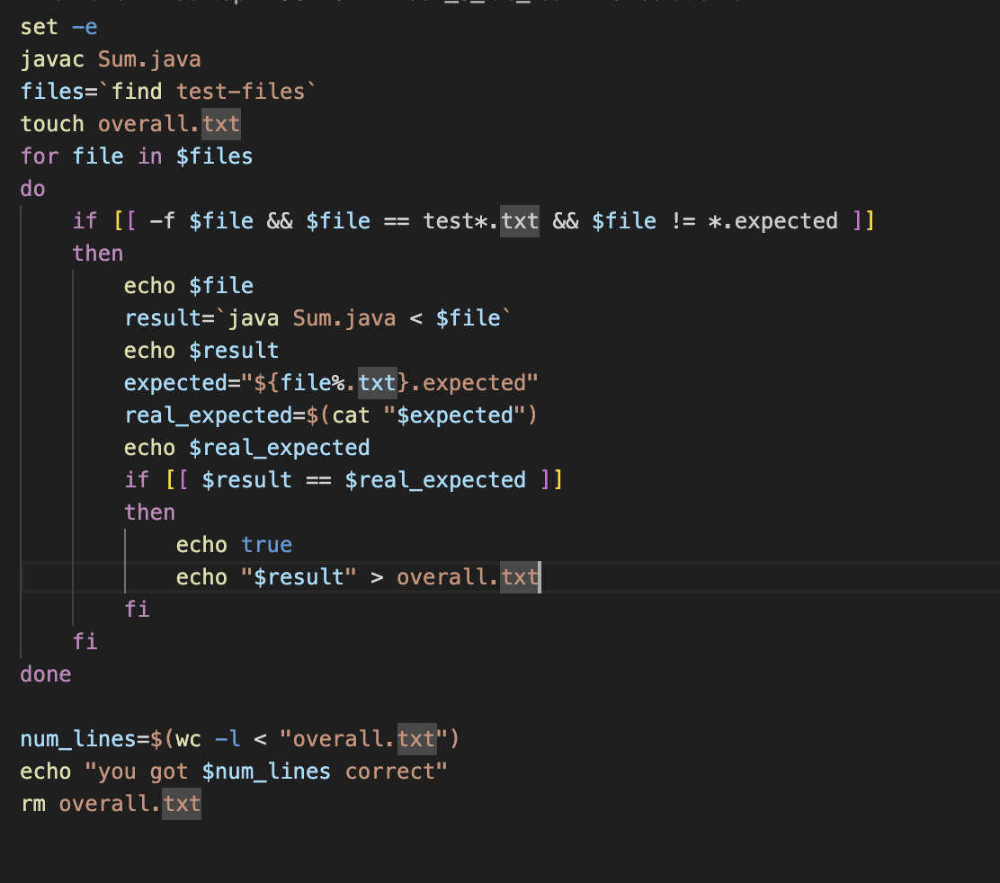

# Lab Report 5

## Part 1

Question:

So my question is regarding of `solution.sh`. I have created 3 tester files with `.txt` extensions, all of them containing one Integer. Than i created 3 files with `.expected` extension. Test 1 and 2 are correct in the sense that `test1.expected` and `test2.expected` contain an intiger 1 larger than thier counterparts. It produces correct output for 3 test out of the 4, but when all 3 tests are present in the `test-files` it only outputs that 1 of them are correct (when it supposed to be 2).

TA: 
Try creating more combination of 2 files in `test-files`, with the incorrect `test3.txt` in there or try putting in the `test files` 2 or 3 correct tests and look at the output.txt.

Student:

It seems like the output.txt is being overriden each time the answer is correct, rather than appending it overwrites it. it doesn't fail when there is only 1 test case or when there is only 1 correct and multiple or 1 incorrect test case.

- End

- `week9`
- `week9/Sum.java`
- `week9/solution.ssh`
- `week9/test-files`
  -  `test-files/test1.txt`: "2"
  -   `test-files/test2.txt`: "4"
  -   `test-files/test3.txt`: "7"
  -   `test-files/test1.expected`: "3"
  -   `test-files/test2.expected`: "5"
  -   `test-files/test3.expected`: "4"

Sum.java: 

## Part 2

- For me presonally, the bash scipt was the most new and interesting. Never would have i thought that you can make repetivtive work that musch quicker. I found week 6 and 9's lab the most interesting since we had to create a bash script. While it is very useful it is challenging aswell for example where to put `space` for `if` statements. This topic seems very useful for the future.

