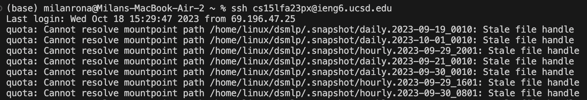

## Lab Report 2

---
# Part 1

- Write a web server called StringServer

*The code is probably wrong somewhere, since when ran it, i was unable to start a server. It said the server started but it didn't give me a link for access*

---
# part 2

- **The path to the private key for your SSH key for logging into ieng6**

- **The path to the public key for your SSH key for logging into ieng6**

- **A terminal interaction where you log into ieng6 with your course-specific account without being asked for a password.**

---
# Part3

I learned a lot of new things about servers and remote access. My knowledge on the topic previously was close to nothing. I found it very intresting setting up web servers and using methods through them. The NumberServer was very intresting, I saw some real life aspect of coding. Running webservers and running methods from the quary and how you can control that through code was also new for me. 

