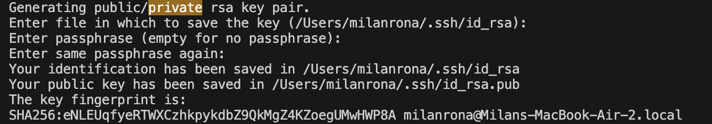

## Lab Report 2

---
# Part 1

- Write a web server called StringServer

- **example 1**
I inputed `"how are you"`. The handle request method of my code is called. The string method of `.contains()` is called and adds it to the return string. Counter is incramented before adding them therefore `counter = 1` after the call is executed.

- **example 2**
I inputed `"whoisthis"`. The handle request method of my code is called. The counter is incramented therfore `counter = 2`. The string is added to the `return string` with a new line `\n` at the end.

if no arguement is passed to `/add-message?s=` than error is reported due to the `split()`.

---
# part 2

- **The path to the private key for your SSH key for logging into ieng6**

- Updated Private key

- **The path to the public key for your SSH key for logging into ieng6**

-Here is an upedated version 

- **A terminal interaction where you log into ieng6 with your course-specific account without being asked for a password.**

---
# Part3

I learned a lot of new things about servers and remote access. My knowledge on the topic previously was close to nothing. I found it very intresting setting up web servers and using methods through them. The NumberServer was very intresting, I saw some real life aspect of coding. Running webservers and running methods from the quary and how you can control that through code was also new and gave me a far deeper understanding of server than i had before. 

