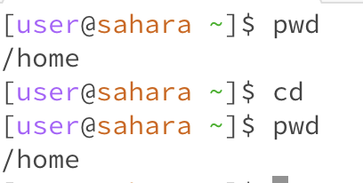
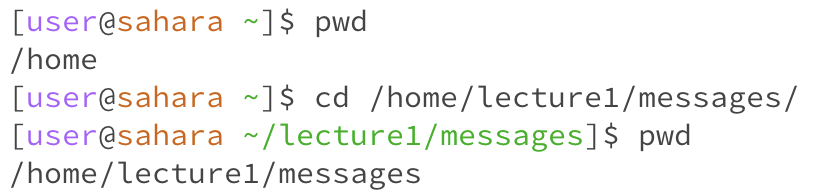
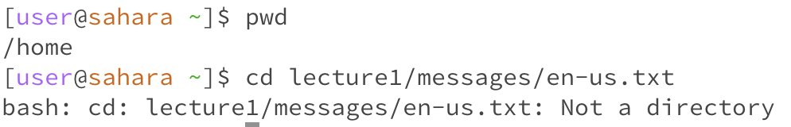
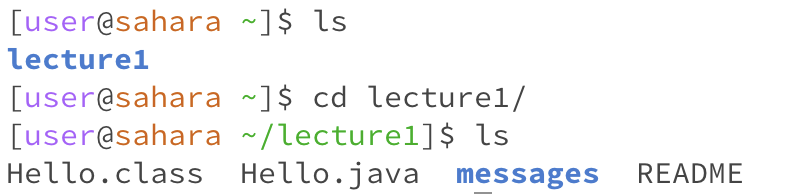
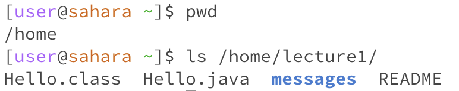
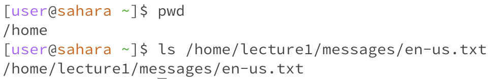
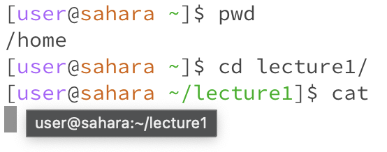
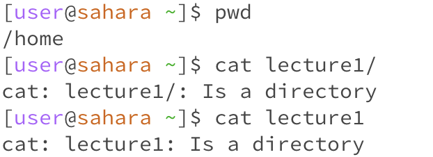
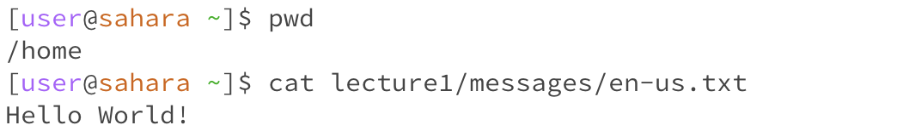

## Lab Report 1

---
# Change Directory

1) Running command with *no* argument
we are currently in the **home** directory.
Having *no* arguements meant that there was no change or output from the terminal.
We are currently still in the **home** directory as seen in the picture below. It is not an error.

2) Running command with a *path to a directory* as an arguement
We are currently in the **home** directory.
We imput this:

 
`cd/home/lecture1/messages/`

we see that the present working directory *(pwd)* is messages rather than home.
This is not an error rather a **correct** way to change directory.

*view picture below*

3) Share an example of using the command with a path to a **file** as an arguement.
We are starting from the home directory again.
This time we are going to the `file en-us.txt`
We get an error in this instance, due to the fact that we are going to a **File** rather than a **Directory**.
Change directory can only switch to directories and in this case we are trying to change to a txt file.

---

# List

1) Running command with *no* arguement

If we are currently in lecture1 directory, if we run ls it lists all the **files and other directories** that are **directly under** the *current* directory in the unix file hierarchy. In the listing it highlights directories in blue. This is not an error
* doesnt change the directory you are currently in

2) Path to a directory as an argument
We are currently in the **home** directory. When we run ls with a path to a directory it lists file's and other directories under the directory the path goes to. It doesnt cause an error, but rather a good way to see what is in directories other than what is the current.

3) Path to a File as an arguement
The working directory was and even after running the code remains **home**.
The output is the path to the file, so it doesn't  list anything rather returns the path we input.
It is not an error, but since its not a directory, there are no other directories or files to return.

---

# Cat *(view or creat a file)*

1) Running command with *no* arguement
The starting directory will be lecture1. In this case we get an error, since cat is for viewing or creating a file. Running it with no arguement means either could create a file with no name or open a random file, which just doesn't make sense.

2) Path to a directory as an argument
The starting directory is **home** again. We input 'cat lecture1', the program outputs 'lecture1' is a directory. This is an error due to the fact that cat can view or create a file. Therefore when we give it a path to a directory it doesn't know what to do, therefore gives us this message.

3) Path to a file as an arguement
The current directory is **home** again. we input the `en-us.txt` file's path. The output is whats in the file. Therefore cat returned what was in the file. This is not an error rather it helped us view this specific file.

